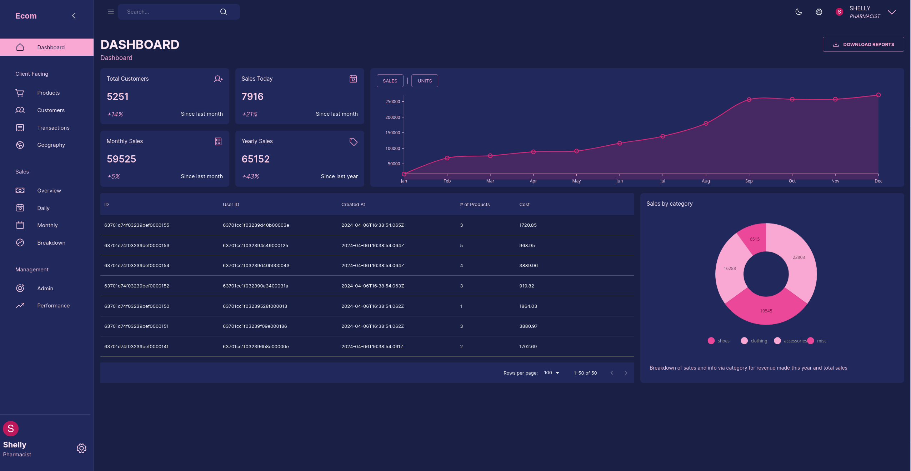
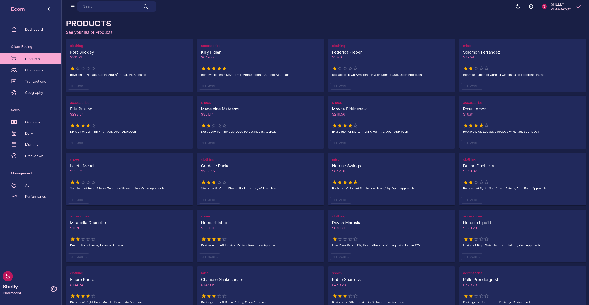
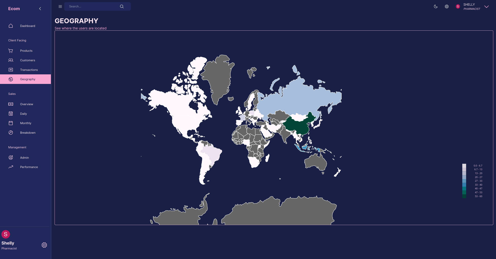
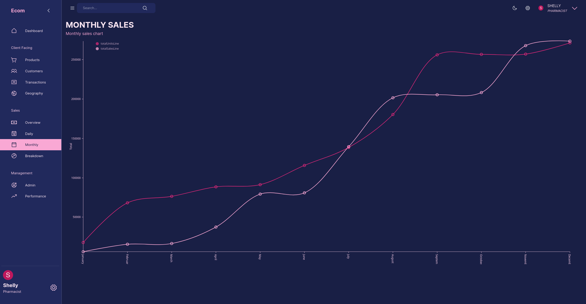
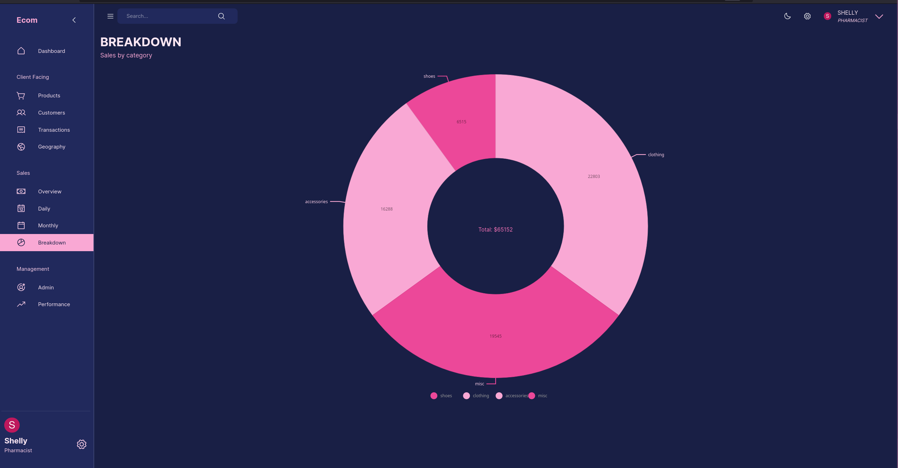

# React dashboard

### quickstart

```sh
docker start mongodb
pnpm dev ./web && pnpm dev ./server
# open localhost:5173
```

### stack

- React
- MUI
- Express
- Mongo
- typegoose
- Redux toolkit query

### overview
-- Dashboard


-- Products


-- Geolocation of customers


-- Sales


-- Breakdown


### routes

#### Client-facing: shows stat for the currently logged-in user

prefix with : /client

| method | route         | description                          |
| ------ | ------------- | ------------------------------------ |
| GET    | /products     | get list of products and reviews     |
| GET    | /customers    | get list of customers                |
| GET    | /transactions | get list of transactions             |
| GET    | /geography    | get customer details, geographically |

#### management

prefix with : /management

| method | route            | description                          |
| ------ | ---------------- | ------------------------------------ |
| GET    | /admins          | get list of admins                   |
| GET    | /performance/:id | get performance details for given id |

#### misc

| method | route             | description                        |
| ------ | ----------------- | ---------------------------------- |
| GET    | /general/user/:id | User info for the given id         |
| GET    | /dashboard        | Dashboard for the logged-in user   |
| GET    | /sales            | sales details for the current user |

That's pretty much it, happy hacking!
